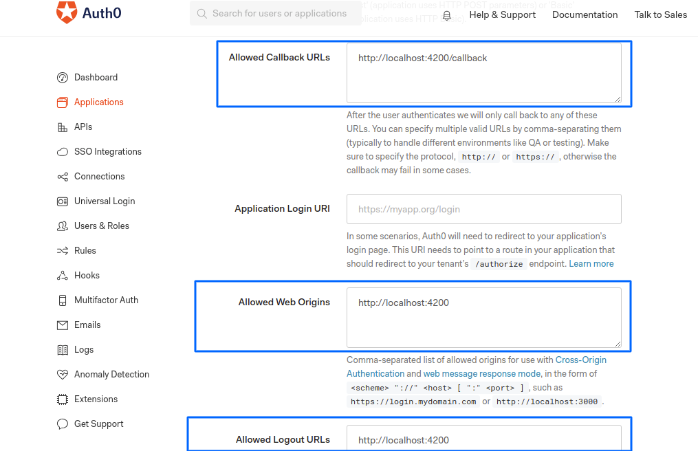
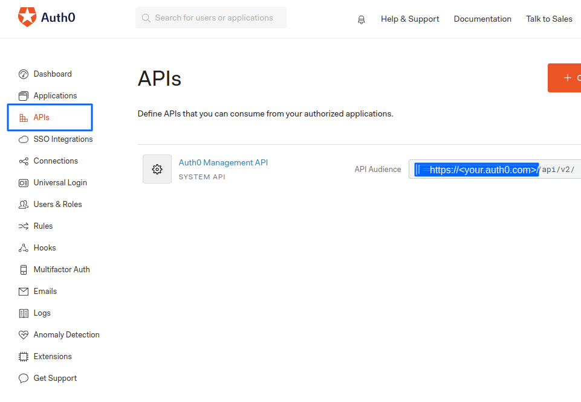

# Auth0 Authentication

> Note: Not official support, Just love to contribute ;-)

Authentication with OAuth0 in Angular and NodeJS.

Below is the solution for to get Access Token as JWT and JWT verification with NodeJS.

## JWT Access Token
1. Need to use audience

2. Configuration in angular app. All the keys are case sensitive. Use `environment.ts` file to store credentials.
```
auth0 = new auth0.WebAuth({
    clientID: <your_client_id>',
    domain: '<your.auth0.com>',
    responseType: 'token id_token',
    audience: 'https://<your.auth0.com>/api/v2/',
    redirectUri: 'http://localhost:4200/callback',
    logoutRedirect: 'http://localhost:4200',
    scope: 'openid profile email'
});
```

3. Auth0 Client Configuration

- Client settings



- Audience URL



### Notes

1. If you want access token as JWT then you must have to set audience.
2. Set APIs https://<your.auth0.com>/api/v2/ in audience as given above example. Userinfo endpoint not working for me.
3. In the URL / is required at last. https://<your.auth0.com>/api/v2/
4. Node side JWT verification
```
const authCheck = jwt({
    secret: jwks.expressJwtSecret({
        cache: true,
        rateLimit: true,
        jwksRequestsPerMinute: 5,
        jwksUri: 'https://<your.auth0.com>/.well-known/jwks.json'
    }),
    // This is the identifier we set when we created the API
    audience: 'https://<your.auth0.com>/api/v2/',
    issuer: 'https://<your.auth0.com>/',
    algorithms: ['RS256']
});
```
5. In the URL / is required at last. https://<your.auth0.com>/api/v2/ and https://<your.auth0.com>/

## Get Roles in Userinfo

1. Add roles and assign roles to users using auth0 dashboard.

2. Add rules in your auth0. 
```
function (user, context, callback) {

  // Roles should only be set to verified users.
  if (!user.email || !user.email_verified) {
    return callback(null, user, context);
  }

  user.app_metadata = user.app_metadata || {};
  user.app_metadata.roles = context.authorization.roles;
  auth0.users.updateAppMetadata(user.user_id, user.app_metadata)
    .then(function () {
      context.idToken['https://example.com/roles'] = user.app_metadata.roles;
      callback(null, user, context);
    })
    .catch(function (err) {
      callback(err);
    });
}
```